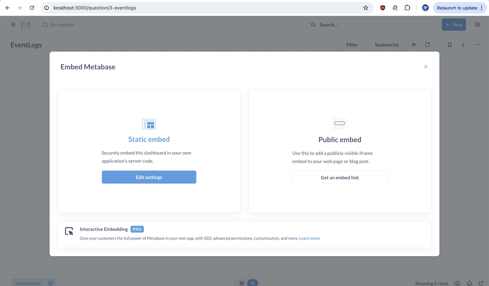

This shows how to setup metabaes docker image and then embed a question. 

## Step 1: Setting up metabase

Edit the `docker-compose.yml` file and set the right value for the mysql password and ensure the connection works. 
`docker compose up -d`

The first time metabase will setup it's tables and drivers and other settings. So be patient for that. 

## Step 2: Write a question

Create a question in metabase and then create an embed. Ensure that in the account you have enabled static embedding. Dynamic embedding is only available to pro/enterprise users. 

## Step 3: Embed in your application

There are two parts of this. First you generate an iframe using the secret key provided by metabase. There is a script in this repo which shows how to do that. This script generates the iframe url which can be embedded in your frontend. 

